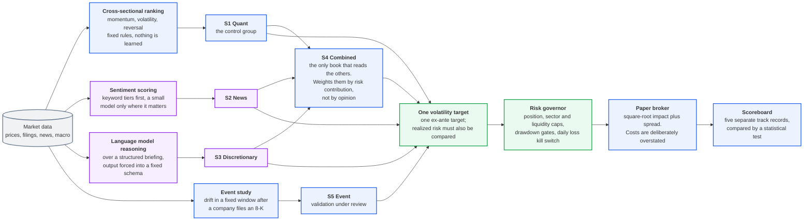
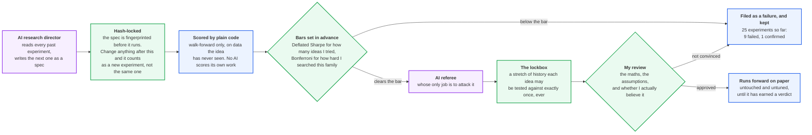

# Multi-Strategy Systematic Fund

**2026-09 quant audit:** profitability is unproven. Event-timing lookahead,
backtest accounting and paper order ownership have been corrected. Realized
risk and live capacity constraints still need work. See the
[full audit](QUANT_AUDIT_2026-09-10.md); historical confirmation labels below
are not proof of an executable edge.

Deployed to the paper service on 2026-09-11 UTC.
[Deployment verification and remaining work](DEPLOYMENT_2026-09-11.md).

Five strategy books trade the same universe on paper money so they can be
compared honestly before any real capital is at risk. The strategies are the
easy part. The interesting part is the machinery that stops me from fooling
myself about them.

$3M paper book, 500 US equities plus liquid crypto, 10% annualized vol target,
no leverage. It runs on free data (yfinance, ccxt public, SEC EDGAR, FRED).

## How it fits together

Two diagrams. The colours say who is responsible for each box:

🟩 **my decision** (every formula, limit and trading rule)
🟦 **plain code** (deterministic, same input gives the same answer every time)
🟪 **an AI agent** (proposes and argues, never has the last word)

### 1. Five books, four unrelated mechanisms

These are not five steps of one pipeline. They are separate systems with
nothing in common except the data they read and the risk ceiling they answer
to. A ranking model, a sentiment reader, a language model and an event study
have no shared logic, and that is the point: if four unrelated methods
disagree, at most one of them is right about any given day.

S4 is the exception, and it is drawn that way. It is the only book that reads
the others.



### 2. How an idea is allowed to become a strategy

This is the part that matters. Nothing gets through by being convincing.



The short version: the AI proposes experiments and attacks results. It does not
score its own work, does not move a target after seeing the data, and does not
get to decide that something is true.

## The books

| Book | Decision maker | Signal |
|------|----------------|--------|
| S1 Quant | deterministic code, no language model at all | price, volume, factor |
| S2 News | lexicon tier plus a cheap model for headline scoring | Yahoo RSS, SEC 8-K |
| S3 Discretionary | a frontier model inside a hard risk wrapper | S1 + S2 + regime briefing |
| S4 Combined | risk-parity ensemble of the above | S1, S2, S3 |
| S5 Event | event candidate; historical validation under review | 8-K post-filing drift |

S1 is the control group. If the model-driven books cannot beat plain code, the
models are only adding cost, and I would rather learn that on paper. All five
books share an ex-ante volatility target; the audit found unequal realized
risk, so target normalization alone does not establish a fair comparison.

## The rule I wrote before I had any results

No superiority claim before 60 trading days **and** p < 0.05, on a paired
Diebold-Mariano test with Newey-West standard errors, computed server side.

The 2026-09-09 snapshot has n = 16 and p = 0.7555, with realized S3/S1
volatility ratio 3.321. The day filter also includes an exchange holiday and
the unfinished snapshot day. No superiority claim is supported.

## Research record

25 experiments so far. 9 FAIL, 1 PASS, 1 CONFIRMED, the rest open or superseded.
These historical labels predate the quant audit. The event confirmation
requires fresh validation after the timing and implementation corrections;
see [record corrections](research/CORRECTIONS.md).

The harness is built to make a false positive expensive:

- every spec is hash-locked before it runs, so the parameters cannot drift
  toward a result
- a one-shot lockbox period that a hypothesis family may be tested against
  exactly once
- family-level Bonferroni, so the more I search a family, the higher the bar
- Deflated Sharpe against the number of trials actually run
- validation is walk-forward only, plus PBO. A profitable in-sample backtest
  proves nothing and is not accepted as evidence
- negative results are written up with the same care as positive ones

## The agents

Every equation, risk limit, cost assumption and trading rule in this repo was
written or approved by me. The agents work inside those decisions. Each has one
narrow job, and each is missing, on purpose, the capability that would let it
close its own loop.

| Agent | Job | What it cannot do |
|-------|-----|-------------------|
| Portfolio manager (S3) | reads a briefing and proposes a target portfolio | send an order. Every proposal passes a deterministic wrapper: position, sector, gross and liquidity caps, plus a citation check on its reasoning |
| Headline scorer (S2) | scores news and filings for direction and confidence | size a position or pick a name |
| Research director | reads the full research history and designs the next experiments | compute its own results, write the ledger, or choose its own threshold |
| Adversarial referee | attacks every PASS before it can be promoted | approve anything. It only objects |
| Security auditor | reviews the tree on a rotation and reports | change a single line |

The split that matters: the agent that proposes an experiment is never the
process that scores it. Results and the registry are written by deterministic
code that no agent can call.

## The security agent

`research/security_audit.py` is read only. It rotates, so coverage is provable
rather than assumed: it always takes the least recently reviewed files first and
records when each file was last seen. Two layers.

Deterministic rules run on everything: credential literals, shell injection,
unsafe deserialization, `eval` and `exec`, TLS disabled, broad excepts that
swallow a security check, permissions on secret files, and gitignore coverage.
Then a model pass reads the current slice for what a regex cannot see, for
example a limit that can be bypassed or a guard that fails open.

Last pass: 73 files in scope, zero critical findings. The report is in
`security/reports/`, which is the only place it can write, and a test asserts
that by watching the filesystem.

Two things it did on its first real pass, both in the repo:

It found that `enabled` was a kill switch that failed open. The live loop had a
hardcoded list of books, so four of the five `enabled` flags were never read.
The config claimed three books were switched off while all of them traded every
tick. An earlier note in the file had spotted the divergence and written a
comment about it instead of closing it. A comment is not a control, and an
operator reaching for that flag mid-incident would have believed a book was
stopped. Disabled now means the book goes flat.

And it produced a bad finding of its own: a critical with no content in it, just
an ellipsis. An empty critical is worse than no finding, because it costs a
reader real time and leads nowhere. A finding now has to carry its own evidence
to reach the report.

## Security work I have not done yet

This is paper money and a personal project, so I stopped where the cost stopped
being worth it. That is a judgment call rather than an oversight, and this is
the list I would work through first if real capital went in:

- a managed secrets store with automatic rotation, instead of a 0600 env file
- authentication and TLS in front of the dashboard
- signed commits and a protected main branch
- pinned dependencies plus automated vulnerability scanning
- a least privilege service account with no sudo rules at all
- audit logs shipped off the host so they survive the host
- encryption at rest for the state ledger
- egress allowlisting, so the process can only reach the APIs it actually needs
- hardware 2FA and an IP allowlist on the broker account

Secrets today: nothing is read from anywhere but a gitignored `.env` (see
`.env.example`), and broker credentials are deliberately not in this repo at
all. The gateway reads them from its own root-owned file outside the tree, so
the trading process never holds them and they cannot reach a diff.

## Things that are pessimistic on purpose

Costs use square-root market impact plus a modeled spread, and fills are never
flattered. A degraded data fetch produces a no-trade tick instead of a guess.
A paper account at a real broker mirrors part of the book, so modeled fills can
be checked against what an actual venue does with the same order.

## Tests

354 offline tests. The suite is not allowed to touch anything live: not the
broker, not the network, not systemd, not a paid API. Each of those four guards
exists because the suite once did exactly that, and the incident is written up
next to the fixture that prevents it.

```bash
python3 -m venv venv && source venv/bin/activate
pip install -r requirements.txt
python -m pytest tests/ -q
```

## Layout

```
core/data/      free data providers (equities, crypto, macro)
core/broker/    paper broker and the cost model
core/ledger/    cash, positions, P&L, equity curve
core/risk/      the risk governor, which every book passes through
systems/        the five books
research/       pre-registration harness, director, security audit
backtest/       walk-forward, Deflated Sharpe, PBO
config/         capital, risk limits, costs, universe
```

`SPEC.md` is the design. `TECHNICAL_APPENDIX.md` has the formulas.
`RESEARCH_LOG.md` is the lab notebook, including the experiments that failed.

Paper money. Nothing here is investment advice.
