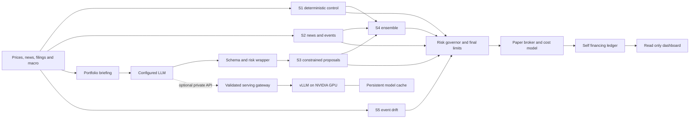

# Multi-Strategy Systematic Fund

A Python paper-trading research system that separates LLM proposals from
deterministic execution. Research agents propose experiments and critique
results; code validates outputs, enforces risk limits, models costs and records
performance. Profitability and a model-driven trading advantage remain unproven.

The repository includes five strategy books, an authenticated model-serving
API, GPU Kubernetes manifests, concurrent inference measurements and a read-only
monitoring dashboard. Live accounts, credentials and operational records are
excluded from the package and public repository.

## Start with the offline demo

Use Python 3.12 or 3.14. No cloud, broker, market-data or model credentials are
needed for the tests or dashboard demo.

```sh
python3 -m venv .venv
source .venv/bin/activate
python -m pip install -e '.[dev,serving]'
python -m pytest
ruff check core systems backtest runtime dashboard scripts research tests serving
python -m build
fund-dashboard-demo --port 8080
```

Open http://127.0.0.1:8080 for the dashboard. Its demo banner and data are
explicitly synthetic; they do not show market results. The normal operational
entry point is `fund-paper --help`. Review configuration and deployment notes
before starting it: it can read configured integrations and update paper state.

CI runs offline tests, defect checks and package builds on Python 3.12 and 3.14.
The source distribution and wheel use an explicit package allowlist. Runtime
and direct development dependencies are pinned; all transitive dependencies
are not locked, so use the retained environment/image evidence when reproducing
a measured run. Deployment and cloud tests do not purchase resources.

## Architecture


```mermaid
flowchart LR
    Data[Prices, news, filings and macro] --> S1[S1 deterministic control]
    Data --> S2[S2 news and events]
    Data --> Brief[Portfolio briefing]
    Model[Configured LLM] --> Wrapper[Schema and risk wrapper]
    Brief --> Model
    Wrapper --> S3[S3 constrained proposals]
    S1 --> S4[S4 ensemble]
    S2 --> S4
    S3 --> S4
    Data --> S5[S5 event drift]
    S1 --> Risk[Risk governor and final limits]
    S2 --> Risk
    S3 --> Risk
    S4 --> Risk
    S5 --> Risk
    Risk --> Broker[Paper broker and cost model]
    Broker --> Ledger[Self financing ledger]
    Ledger --> UI[Read only dashboard]
    Model -. optional private API .-> Gateway[Validated serving gateway]
    Gateway --> GPU[vLLM on NVIDIA GPU]
    GPU --- PVC[Persistent model cache]
```

| Book | Approach | Implementation |
| --- | --- | --- |
| S1 Quant | Deterministic ranking and portfolio construction; the control | [S1](systems/s1_quant) |
| S2 News | Lexicon and configured model-assisted headline/event scoring | [S2](systems/s2_news) |
| S3 Discretionary | Structured portfolio proposals inside deterministic controls | [S3](systems/s3_llm) |
| S4 Combined | Ensemble of the first three books | [S4](systems/s4_combined) |
| S5 Event | Post-filing event research; validation remains under review | [S5](systems/s5_event) |

The default `llm.provider: auto` preserves the Anthropic/Ollama/deterministic
fallback chain. The optional `vllm` provider uses the validated gateway and
records failed calls, fallback source and token usage. Neither a model response
nor its confidence can bypass risk controls or send a broker order. Switching
a measured paper book to another model requires a separately registered trial.

The public sample configuration disables broker execution, runtime model-call
budgets and automatic apply/commit/restart operations. These are explicit
fresh-clone safety defaults, not the settings of the retained GPU benchmark.
Enabling integrations requires deliberate configuration and credentials.

## Model serving and GPU evidence

The FastAPI gateway implements authentication, input/context/output bounds,
fixed JSON contracts, deadlines, cancellation, explicit overload responses and
Prometheus metrics. Its single-worker admission limit is eight requests. It has
no broker credentials, order endpoint or fund-ledger mount.

The Kubernetes service pins vLLM 0.31.0 and the Apache-2.0
Qwen2.5-1.5B-Instruct model revision. It requests one NVIDIA GPU, mounts a 20 GiB
persistent cache, gates readiness on actual model availability and keeps both
services private. This small model is a serving demonstrator, not a validated
trading decision-maker.

On October 9, 2026, an isolated GKE deployment on an NVIDIA L4 passed
[real CUDA/model verification](research/model_serving_20261009/gpu_verification_after_restart.json)
and a [pod replacement/cache persistence check](research/model_serving_20261009/cache_persistence.json).
The [concurrent workload](research/model_serving_20261009/benchmark_gpu_actual.json)
included 128 measured attempts and four separate warmup requests. At concurrency
eight, all 32 requests succeeded: 10.86 valid responses/second and successful
p95 latency of 0.791 seconds. At concurrency 16, the eight-request admission limit
produced 24 HTTP429 rejections; all failures remain in the results. This was a
short, repeated sentiment prompt with prefix caching and a localhost port-forward,
not a representative financial-news evaluation or production reliability study.

See the [deployment runbook](deploy/kubernetes/RUNBOOK.md) and
[measurement definitions and records](research/model_serving_20261009/benchmark_README.md).
Real GPU/model measurements are retained separately from HTTP test-double
results and synthetic research fixtures. A failed initial image or model
startup is retained as a failure. Kubernetes workload deletion alone does not
stop cloud GPU-node billing. The isolated demo's cluster, GPU node, cache disk
and image repository were [verified deleted](research/model_serving_20261009/cloud_cleanup.json)
after measurement.

## Code tour for reviewers

- [Serving API](serving/api.py) and [contracts/client](core/llm): validated model requests, bounded concurrency and cancellation.
- [Risk governor](core/risk/governor.py), [final limits](core/risk/final_limits.py) and [ledger](core/ledger/ledger.py): finite-input checks, constrained allocations and atomic accounting.
- [Research harness](research/harness.py), [director](research/director.py) and [backtest](backtest/engine.py): registered experiments, held-out evaluation and causal history checks.
- [Benchmark](scripts/benchmark_model_serving.py) and [research demo](scripts/demo_model_research.py): reproducible HTTP workloads, all-attempt failure accounting and a synthetic proposal/critique pipeline.
- [ML engineering review](docs/ML_ENGINEERING.md), [tests](tests) and [CI](.github/workflows/ci.yml): verification scope and remaining limitations.

## Evaluation and operating limits

The registered research policy requires at least 60 trading days and a paired
Diebold-Mariano test with Newey-West errors before a superiority claim. A common
ex-ante volatility target does not guarantee comparable realized risk. Read the
[quant audit](QUANT_AUDIT_2026-09-10.md) and
[research corrections](research/CORRECTIONS.md) before using historical success
labels. Neither a test-suite pass nor a short paper run proves an executable edge.

Remaining issues include event availability timestamps, some research RNG and
covariance assumptions, execution realism, realized-risk comparability and
fresh validation of corrected hypotheses. They are described in the engineering
review; historical results are not silently repaired or regraded.

The dashboard binds localhost by default, escapes untrusted state text and
shows unavailable/stale data explicitly. Remote binding requires credentials
from environment variables. Keep it behind an SSH tunnel or trusted TLS proxy;
Basic authentication does not encrypt HTTP traffic. Legacy deployment scripts
fail closed. Current operational and model-service entry points are documented
in their deployment notes.

## Further reading

- [Design specification](SPEC.md) and [technical formulas](TECHNICAL_APPENDIX.md)
- [Research log](RESEARCH_LOG.md) and [deployment notes](DEPLOYMENT_2026-09-11.md)
- [Contributor instructions](AGENTS.md) and [research invariants](CLAUDE.md)

[Noah Dericioglu’s portfolio](https://curatedengineer.com) · [Contact](mailto:aderici@unc.edu)
