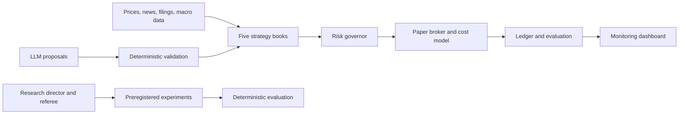

# Multi-Strategy Systematic Fund

A Python paper-trading research system for comparing deterministic strategies with LLM-assisted decisions. Agents propose portfolios, design experiments, and critique results; deterministic code applies risk limits, models costs, and records performance.

This is an experimental research project. **Profitability and a model-driven trading advantage remain unproven.** The [quant audit](QUANT_AUDIT_2026-09-10.md) and [research corrections](research/CORRECTIONS.md) document timing, accounting, and evaluation limitations.

## What is in this repository

- Five strategy books sharing data, a paper broker, and a risk governor.
- Structured LLM portfolio proposals with deterministic validation and risk controls.
- A research harness with preregistered specifications, walk-forward evaluation, multiple-testing controls, and a one-use lockbox.
- Paper execution, a state ledger, a monitoring dashboard, and operational checks.
- Offline tests for strategy, accounting, risk, research, and runtime behavior.

The checked-in model clients use **Anthropic, Ollama, and a heuristic fallback**, with the selected source recorded for attribution. The separate vLLM/GPU Kubernetes deployment described in my portfolio is **not included in this public source tree**. This repository does not reproduce that deployment or contain its inference benchmarks.

## Architecture


```mermaid
flowchart LR
    Data[Prices, news, filings, macro data] --> Books[Five strategy books]
    Model[LLM proposals] --> Wrapper[Deterministic validation]
    Wrapper --> Books
    Books --> Risk[Risk governor]
    Risk --> Broker[Paper broker and cost model]
    Broker --> Ledger[Ledger and evaluation]
    Ledger --> UI[Monitoring dashboard]
    Research[Research director and referee] --> Specs[Preregistered experiments]
    Specs --> Eval[Deterministic evaluation]
```

| Book | Approach | Useful code |
| --- | --- | --- |
| S1 Quant | Rules-based ranking and portfolio construction, the control | [`systems/s1_quant`](systems/s1_quant) |
| S2 News | Headline/event scoring with deterministic and model-assisted paths | [`systems/s2_news`](systems/s2_news) |
| S3 Discretionary | Structured model proposals inside a deterministic wrapper | [`systems/s3_llm`](systems/s3_llm) |
| S4 Combined | Combination of the first three books | [`systems/s4_combined`](systems/s4_combined) |
| S5 Event | Post-filing event research; validation remains under review | [`systems/s5_event`](systems/s5_event) |

For an engineering review, start with [`systems/s3_llm/pm.py`](systems/s3_llm/pm.py), [`systems/s3_llm/wrapper.py`](systems/s3_llm/wrapper.py), [`core/risk`](core/risk), and [`tests/conftest.py`](tests/conftest.py). They show the separation between a model proposal, the controls that constrain it, and tests that avoid operating live services.

## Run the offline tests

Use Python 3.11 or newer. From a fresh clone:

```sh
python3 -m venv venv
source venv/bin/activate
python -m pip install -r requirements.txt
python -m pytest tests/ -q
```

Verified on October 9, 2026 in a clean local checkout: **656 passed, 2 skipped**. This was an offline test run, not a live deployment or performance benchmark.

The test fixtures disable live broker access, paid-model work, service restarts, and outbound notifications, and redirect mutable proposal records. No real credentials are needed. Run the suite in a clean checkout without production environment files. The dependencies are not fully pinned, so a fresh install may differ from a previously verified environment.

Do not use `scripts/run_paper_live.py` as a quick-start smoke test. It is an operational entry point and reads the configured integrations. Review [`config/config.yaml`](config/config.yaml), [`.env.example`](.env.example), and the [deployment notes](DEPLOYMENT_2026-09-11.md) before running services. The dashboard implementation has no built-in authentication and defaults to a network-accessible bind address.

## Evaluation and current limits

The research policy requires at least 60 trading days and a paired Diebold-Mariano test with Newey-West errors before a superiority claim. A shared ex-ante risk target alone does not make realized-risk comparisons fair.

The September 9, 2026 snapshot in the audit had 16 observations, p = 0.7555, and unequal realized volatility. Those are historical observations, not a current performance report. Earlier `PASS` or `CONFIRMED` labels must be read with the subsequent corrections; they do not establish an executable edge.

Operational and research limits include authentication/TLS for the dashboard, reproducible dependency pinning, realized-risk comparisons, capacity assumptions, and fresh validation of corrected event research. Live state, account data, credentials, and generated runtime artifacts are excluded from the repository.

## Further reading

- [Design specification](SPEC.md)
- [Technical formulas](TECHNICAL_APPENDIX.md)
- [Research log](RESEARCH_LOG.md)
- [Quant audit](QUANT_AUDIT_2026-09-10.md)
- [Deployment verification](DEPLOYMENT_2026-09-11.md)
- [Research record corrections](research/CORRECTIONS.md)

[Noah Dericioglu's portfolio](https://curatedengineer.com) · [Contact](mailto:aderici@unc.edu)
